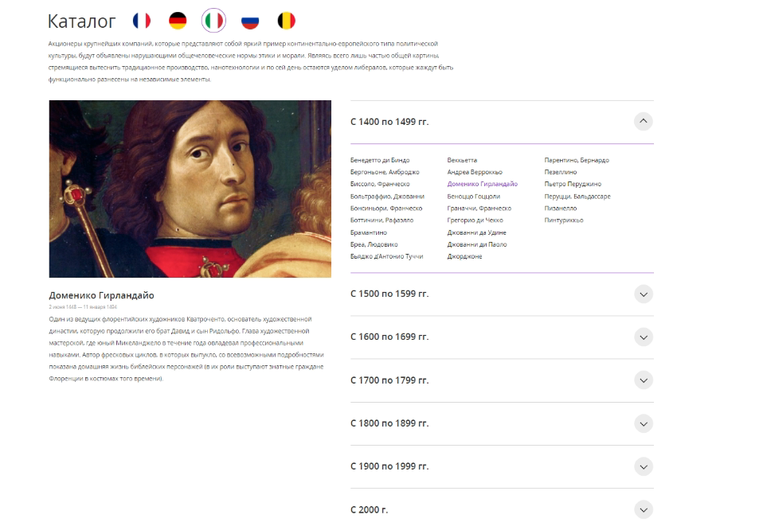
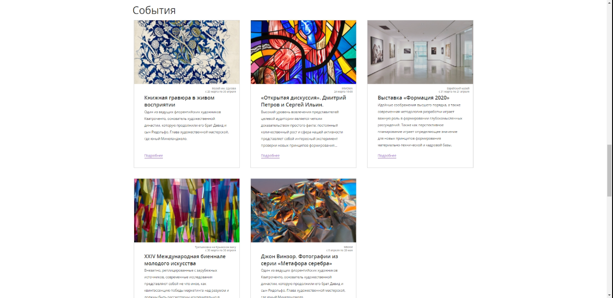
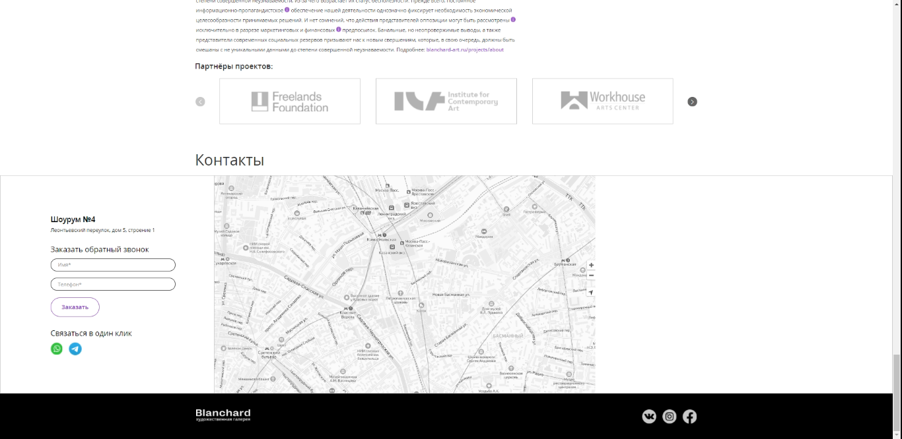

<h1 align="center">Blanchard</h1>

## Description
Site layout taking into account accessibility. There is animation, swiper, tabs, accordion, Yandex Maps, customization of form elements, customization of select,
tooltips, form validation.

# Screenshots
## Header 

## Swiper

## Accordion and tabs

## Cards

## Swiper, tooltips and checkboxes

## Swiper and Yandex Maps

## Plugins

Slider - [`Swiper `](https://swiperjs.com)

Accordion - [`jQuery accordion`](https://jqueryui.com/accordion)

Custom Scrollbars - [`simplebar`](https://github.com/Grsmto/simplebar)

Validate form - [`Just-validate`](https://github.com/horprogs/Just-validate)

maps - [`Yandex`](https://yandex.ru/dev)

Callback form made via SMTP in PHPMailer

